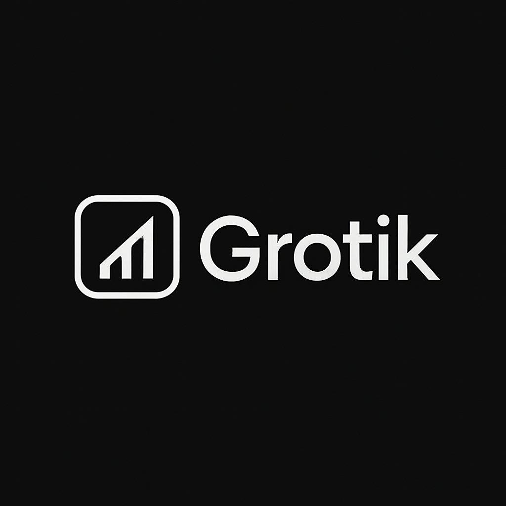

<div align="center">
  
</div>

# ⚡ Grotik

Where language meets finance, magic happens.

> "Learn a language, gain a world. Master finance, own your future."

## 🌟 Why Grotik?

- **Learn While You Earn** - Master new languages while understanding real financial concepts
- **Interactive Blockchain** - Experience safe, simulated financial transactions
- **AI-Powered Learning** - Get personalized lessons that adapt to your style

## 🚀 Features

🎓 **Smart Learning**
- Real-world conversations
- Dynamic difficulty adjustment
- Progress tracking that makes sense

💰 **Financial Playground**
- Safe blockchain transactions
- Virtual currency management
- International money concepts

🤖 **AI Companion**
- Natural conversations
- Instant feedback
- Cultural insights

## 🛠️ Built With Love Using

- Next.js 13 - For lightning-fast experiences
- Stellar SDK - Safe blockchain playground
- Groq AI - Your personal language mentor
- TailwindCSS - Beautiful, responsive design

## 🏃‍♂️ Quick Start

```bash
# Get started in seconds
npm install
npm run dev

# Ready for the world?
npm run build
```

## 🌈 Join The Journey

Every word you learn, every concept you master, brings you closer to global citizenship.

---

Made with 💙 by passionate educators and tech enthusiasts
